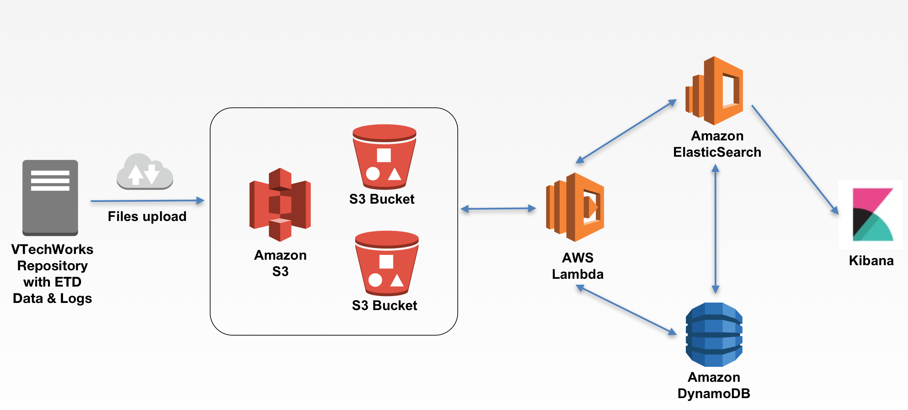

# Documents
* Paper: [ARCHITECTING A CLOUD-NATIVE DATA ANALYSIS APPLICATION FOR ETDS](paper/ETD18_extended_abstract.v2.pdf)
* [ETD18 Presentation slides](presentation/)

# Architecture overview

# Microservices (AWS Lambda)  
* [S3 sync DynamoDB](microservice/s3todb)
* [DynamoDB sync ElasticSearch](microservice/dbtoes)

